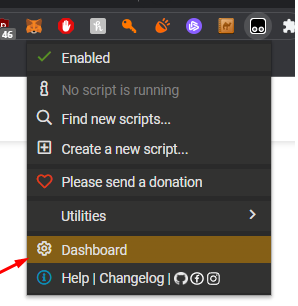
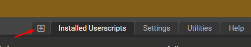
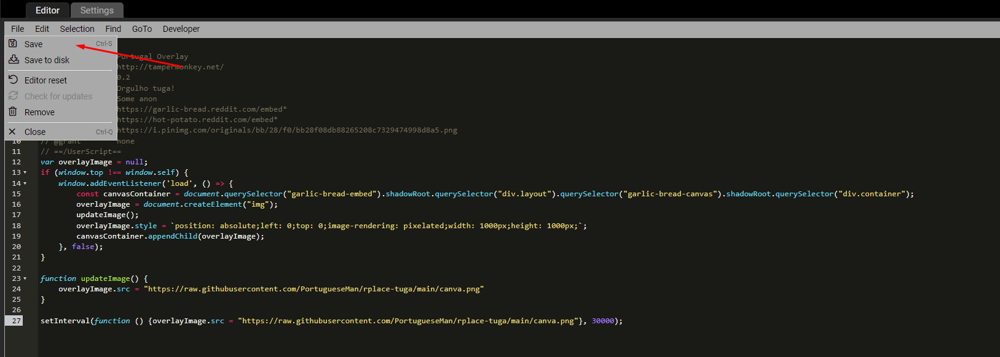

# Intalação de overlay

1. Fazer download da extensão [Tampermonkey](https://chrome.google.com/webstore/detail/tampermonkey/dhdgffkkebhmkfjojejmpbldmpobfkfo)
2. Abrir dashboard da extensão <br> 
3. Criar novo script <br> 
4. Copiar o seguinte código para a caixa de texto:
```
// ==UserScript==
// @name         Portugal Overlay
// @namespace    http://tampermonkey.net/
// @version      0.2
// @description  Orgulho tuga!
// @author       Some anon
// @match        https://garlic-bread.reddit.com/embed*
// @match        https://hot-potato.reddit.com/embed*
// @icon         https://i.pinimg.com/originals/bb/28/f0/bb28f08db88265208c7329474998d8a5.png
// @grant        none
// ==/UserScript==
var overlayImage = null;
if (window.top !== window.self) {
    window.addEventListener('load', () => {
        const canvasContainer = document.querySelector("garlic-bread-embed").shadowRoot.querySelector("div.layout").querySelector("garlic-bread-canvas").shadowRoot.querySelector("div.container");
        overlayImage = document.createElement("img");
        updateImage();
        overlayImage.style = `position: absolute;left: 0;top: 0;image-rendering: pixelated;width: 1000px;height: 1000px;`;
        canvasContainer.appendChild(overlayImage);
    }, false);
}

function updateImage() {
    overlayImage.src = "https://raw.githubusercontent.com/PortugueseMan/rplace-tuga/main/canva.png"
}

setInterval(function () {overlayImage.src = "https://raw.githubusercontent.com/PortugueseMan/rplace-tuga/main/canva.png"}, 30000);
```
5. Deverá ficar assim:
 <br>
Depois gravar e já está feito.
5.  Garantir que po script está ativado <br>  
6. Resultado final: <br>  <br>