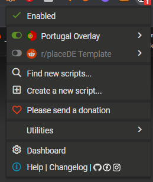
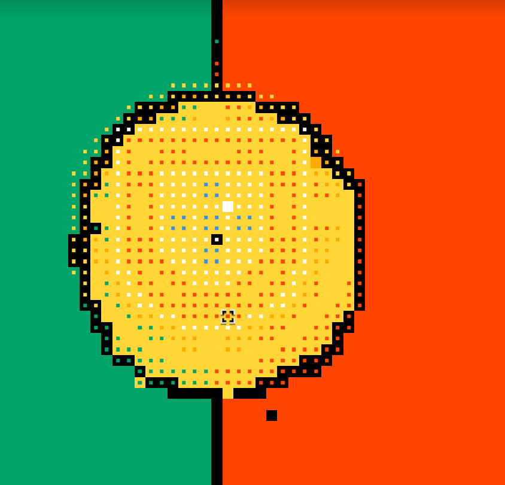

# Instalação de overlay

1. Fazer download da extensão [Tampermonkey](https://chrome.google.com/webstore/detail/tampermonkey/dhdgffkkebhmkfjojejmpbldmpobfkfo)
2. Carregar [aqui](https://github.com/PortugueseMan/rplace-tuga/raw/main/userscript.user.js) e instalar o script
3.  Garantir que po script está ativado    
4. Resultado final:     
